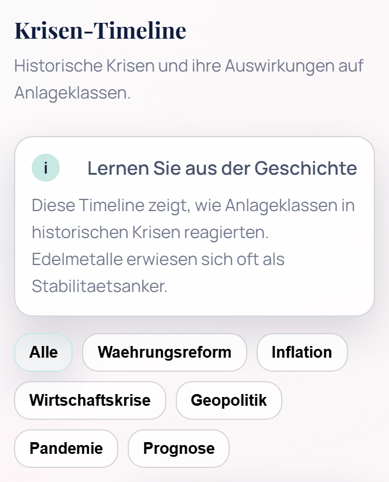
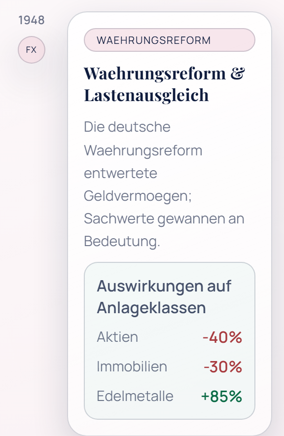
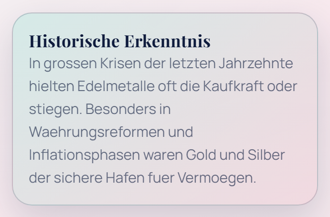

# CRISIS 2050

SwiftUI reference app targeting the newest iOS release (18) that turns the Vibecode prototype into a fully data-backed experience. \
Key capabilities:
- Live bullion pricing from GoldPrice.org, macro indicators (inflation, GDP, defense) via the World Bank API, and crisis monitoring sourced from NewsAPI's political/financial headlines plus World Bank governance/finance signals.
- Currency switching (EUR <-> USD) backed by Frankfurter (ECB-based reference rates) keeps prices aligned with midainvest.com defaults.
- Unified "Beratung anfragen" CTA that opens an in-app contact form and posts the request to your backend endpoint.
- Modern tabbed navigation ("Uebersicht", "Vergleich", "Edelmetalle", "Krisen", "Beratung") coated with the new Liquid Glass design guidance from WWDC25 and aligned with Apple's Human Interface Guidelines / Clean Code for Swift conventions.
- Offline cache + BackgroundTasks-powered refresh keep the dashboard usable without connectivity and trigger local alerts via UserNotifications.
- Reference documentation in `reference/` summarizing the Featured Apple docs, App Store Review Guidelines, and the Clean Code rules applied during development.

## Getting Started
1. Open `CRISIS/CRISIS.xcodeproj` with Xcode 16+.
2. Select the CRISIS scheme and an iOS 18 simulator or device.
3. Build & run (`Cmd + R`). The dashboard loads real data on launch and supports pull-to-refresh.

## Configuration
- Update the consultation endpoint in `CRISIS/CRISIS/Config/AppConfig.swift` (default: `https://api.midainvest.com/contact`).
- Provide a NewsAPI key by adding `NEWSAPI_API_KEY` to your environment or `Info.plist` (see `AppConfig.newsAPIKey`).
- All other networking happens client-side against public APIs (GoldPrice.org, World Bank, Frankfurter); no additional secrets are required.

## Android (Jetpack Compose)
The Android project lives in `android/` and mirrors the iOS data sources and UI flow.

### Getting Started (Android)
1. Open the `android/` folder in Android Studio (Hedgehog/Koala or newer).
2. Ensure the Android SDK 34 platform is installed and let Gradle sync.
3. (Optional) Add a NewsAPI key for the crisis feed:
   - Set `NEWS_API_KEY=your_key` in `android/gradle.properties` or `~/.gradle/gradle.properties`.
4. Run on an emulator or device (API 24+).

### Android Configuration
- Consultation endpoint: `android/core-data/src/main/java/de/vibecode/crisis/core/data/AppConfig.kt`
- NewsAPI: if `NEWS_API_KEY` is blank, NewsAPI articles are skipped automatically.
- All other APIs (GoldPrice.org, World Bank, Frankfurter, Stooq) are public and require no keys.

## Web (GitHub Pages)
The web experience lives in `docs/` and mirrors the app UI/flows with static HTML, CSS, and JavaScript.

### Web Highlights
- ApexCharts-powered comparison charts with SVG fallback handling.
- Crisis timeline section aligned with the mobile prototype.
- CRISIS logo embedded in the header for consistent branding.

### Getting Started (Web)
1. Serve `docs/` locally (e.g. `python -m http.server --directory docs`).
2. Open `http://localhost:8000/` in your browser.

### Web Configuration
- NewsAPI key: open the settings sheet and paste your X-Api-Key (stored locally in your browser).
- Consultation endpoint: `https://api.midainvest.com/contact` (same as the apps).

### Deployment (GitHub Pages)
- `.github/workflows/pages.yml` publishes `docs/` on pushes to `main`.
- Enable Pages in GitHub repo settings and select "GitHub Actions" as the source.

## Screenshots (Updated UI)

## Reference Material
- `reference/apple_documentation.md` - summary of every featured document on developer.apple.com/documentation.
- `reference/app_store_guidelines.md` - condensed list of all numbered App Store Review rules (sections 1-5).
- `reference/clean_code_swift.md` - actionable takeaways from the MaatheusGois Clean Code for Swift guide.

## Continuous Integration (Option 3 from setup discussion)
- All pushes and pull requests targeting `main` automatically trigger `.github/workflows/ci.yml` on GitHub Actions' `macos-14` runners.
- The workflow selects the hosted `Xcode_15.4.app` toolchain (current default on macOS 14 runners), resolves packages, and executes `xcodebuild clean test` for the `CRISIS` scheme on the iPhone 15 simulator.
- To view results, open the "Actions" tab in GitHub; failing builds annotate commits/PRs with the exact step/command output.

